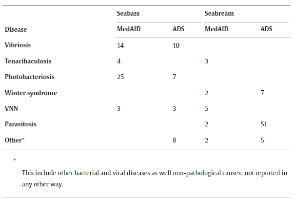

# Home assingment 2

Figure 1 - Me explaning explaning how to work on Git Hub 
## Proposal ideas
### Research Title
*“Developing a new molecular tool for detecting gill parasites in the Mediterranean fish species”*
### General topic or area that this research is addressing
The general topic of this research is advancing parasite detection methods and Mediterranean fish disease monitoring. 
### Research Question(s)
Can we develop an **easy-to-use** and **cheap** tool for parasite detection in   Mediterranean fish species?
Can we see any disease prevalence differences over the years?
Can disease prevalence be explained by other environmental changes?
### How is this research different or new compared to previous research on this question
Until now, the lab has studied bacterial pathogens. In this study, we will study parasite prevalence and compare to the previous works on the topic and the works of the same lab, this research will use material collected throughout the years 2018-2024 to provide a timeline and statistical significance for potential findings.
### Why does this research matter
Commercial fishing and fish farming are major providers of food in the Mediterranean. The health of both wild and farmed fish is paramount, both in terms of the food security of the population and the health of the human population. Parasites are a common source of disease in fish, and the ability to quickly detect and treat it is central for places like fish farms. We want to know what parasites are in the gills of mediterranean fish, to use it as a monitoring tool, and to understand relationships with gills bacterial pathogens 

Table 3. Comparison of disease outbreaks in seabream and seabass in Spain gathered by ADS (Valencia, Canary Islands and Murcia) and the MedAID WP1 surveys in 2016 and 2017. [(*Muniesa, Ana, et al. "An assessment of disease occurrence and mortality in marine fish farming in Spain." Aquaculture Reports 25 (2022): 101257.*)](https://www.sciencedirect.com/science/article/pii/S2352513422002538)
### The biggest challenges expected in carrying out this research
Finding an appropriate set of primers, capable of capturing a large amount of parasite DNA reliably and without much added cost. Attempting to use this detection method while pooling gill samples together, can introduce difficulties to the process of parasite DNA detection, but reduces the costs of running the reactions.
### Preliminary results 
    