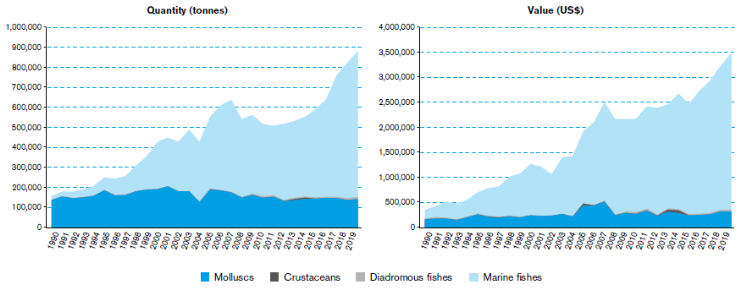

# Home assingment 2

Figure 1 - Me explaning how to work on Git Hub without my ADHD medicine 
## Proposal Ideas/Work in Progress
### <u>Research Title </u>
*“Developing a new molecular tool for detecting gill parasites in the Mediterranean fish species”*
### <u> General topic or area that this research is addressing </u>
The general topic of this research is advancing parasite detection methods and Mediterranean fish disease monitoring. 
### <u> Research Question(s) </u>
Can we develop an **easy-to-use** and **cheap** tool for parasite detection in   Mediterranean fish species?
Can we see any disease prevalence differences over the years?
Can disease prevalence be explained by other environmental changes?
### <u> How is this research different or new compared to previous research on this question </u>
Until now, the lab Im working at, and my [PI - Dr. Danny Morrick](https://med-lter.haifa.ac.il/dr-danny-morick/) has studied bacterial pathogens [(*Meron, Dalit, et al. "Specific pathogens and microbial abundance within liver and kidney tissues of wild marine fish from the Eastern Mediterranean Sea." Microbial Biotechnology 13.3 (2020): 770-780.*)](https://enviromicro-journals.onlinelibrary.wiley.com/doi/full/10.1111/1751-7915.13537). In this study, we will study parasite prevalence and compare it to the previous research done on the topic both by our lab and relevant outside sourses. This research will use material collected throughout the years 2018-2024 to provide a timeline and statistical significance for potential findings.
### <u> Why does this research matter </u>
Commercial fishing and fish farming are major providers of food in the Mediterranean. The health of both wild and farmed fish is paramount, both in terms of the food security of the population and the health of the human population. Parasites are a common source of disease in fish, and the ability to quickly detect and treat it is central for places like fish farms. We want to know what parasites are in the gills of mediterranean fish, to use it as a monitoring tool, and to understand relationships with gills bacterial pathogens.

Figure 2 - Aquaculture Production by Species in Weight (left) and Value (right). [(*Aquaculture in the Mediterranean Natacha Carvalho European Commission, Joint Research Centre, Ispra Jordi Guillen European Commission, Joint Research Centre, Ispra*)](https://www.iemed.org/publication/aquaculture-in-the-mediterranean/)

### <u>The biggest challenges expected in carrying out this research </u>
Finding an appropriate set of primers, capable of capturing a large amount of parasite DNA reliably and without much added cost. Attempting to use this detection method while pooling gill samples together, can introduce difficulties to the process of parasite DNA detection, but reduces the costs of running the reactions. To deal with those issues and to extract DNA from samples, a ["GeneMATRIX Soil DNA Purification Kit **Cat. no. E3570**"](https://eurx.com.pl/docs/manuals/en/e3570.pdf) will be used, as well as a PCR protocol (TBD) and a sequencing protocol (TBD)
### Preliminary results of sample extractions 

| Sample ID | #order | Fish sp. | Tissue box name | Date of collection | Date of necropsy | Length | Weight | Organ | 
| ----------- | ----------- | ----------- | ----------- | ----------- | ----------- | ----------- | ----------- | ----------- |
| 23.12.27.28.Gi | 182 | Decapterus russelli  | Fedor Box 1 | 6.12.23 | 27.12.23 | 20   | 85.8  | Gills |
| 23.12.27.29.Gi | 183 | Decapterus russelli  | Fedor Box 1 | 6.12.23 | 27.12.23 | 20.5 | 96.2  | Gills |
| 23.12.27.30.Gi | 184 | Decapterus russelli  | Fedor Box 1 | 6.12.23 | 27.12.23 | 21.5 | 91.1  | Gills |
| 10.01.24.1.GI  | 185 | Saurida lessepsianus | Fedor Box 2 | 6.12.23 | 10.01.24 | 31.9 | 213.3 | Gills |
| 10.01.24.2.GI  | 186 | Saurida lessepsianus | Fedor Box 2 | 6.12.23 | 10.01.24 | 25   | 95.9  | Gills |
| 10.01.24.3.GI  | 187 | Saurida lessepsianus | Fedor Box 2 | 6.12.23 | 10.01.24 | 24.4 | 97    | Gills |

Table 1 - An example table of 6 datapoints from the extractions made at the end of 2023 and the beginning of 2024.

### Notes on the assingment 
It was very cool to try out this new tool! Thank you for teaching it. Unfortunately, it seems like .md files dont support underlined text, as it doesnt appear in the GitHub README file, even if it appears as underlined in the text editor.  